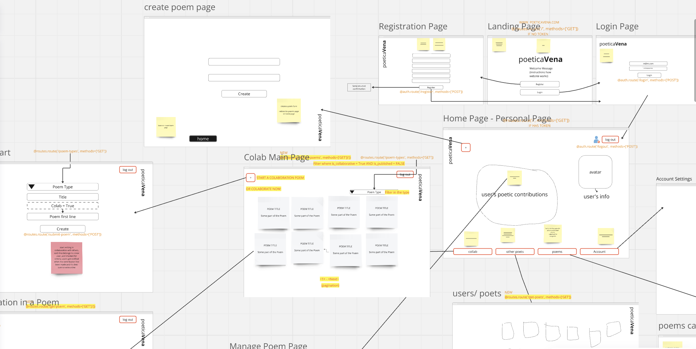

# poeticaVENA

**poeticaVENA** is a collaborative poetry platform enabling users to create, contribute to, and publish poems individually or as part of a group. It combines a creative writing experience with technical solutions for user authentication, data persistence, and real-time collaboration with AI feedback. poeticaVENA aims to engage poets in both creative writing and learning about various poetic forms, offering a space for practice and exploration.

## Key Features

- Creative Writing Tools: Users can write poems in specific forms (currently Haiku and Free Verse). They can create a new poem with attributes like title, type, and whether it’s collaborative. Titles are unique per poet, ensuring individuality while maintaining flexibility for the broader platform.
- Real-Time Feedback: Provides feedback on syllable counts, rhyme matching (future development), and structure to help users adhere to poetic form requirements.
- Collaboration: Allows multiple users to contribute to a single poem, either in real-time or asynchronously, creating a shared writing experience.
- AI Assistance: Integrates OpenAI’s ChatGPT to offer creative feedback and structural suggestions.

### **Backend Technologies and Frameworks**

1. **Language & Framework**:
    - **Python** with **Flask** framework.
    - RESTful architecture for handling requests and responses.
2. **Database**:
    - **SQLAlchemy ORM** for interacting with a relational database (PostgreSQL).
    - Tables include `Poets`, `Poems`,  `PoemDetails` and `PoemTypes`  to track users, poem metadata, and contributions.
3. **Data Validation**:
    - **Pydantic** models for input validation and response serialization.
    - Ensures data integrity at the API level.
4. **Authentication**:
    - **JWT (JSON Web Tokens)** for secure user sessions.
    - Tokens store user identity, allowing seamless authentication across requests.
5. **Additional Tools and APIs**
    - ChatGPT API Integration: Provides users with AI-generated suggestions, feedback, and evaluations on syllable counts, structure, and rhyme matching (for future poetic forms).
    - Manual Syllable Counting Fallback: A custom function for syllable counting, offering a reliable alternative when AI feedback is not accessible.
6. **Deployment**:
    - Hosted on **Render** for production, ensuring scalability and reliability.

## Project Scope and Current State

The platform is currently in its MVP (Minimum Viable Product) stage, focusing on the following functionalities:

- User Registration & Authentication: Users can sign up, log in, and securely manage their accounts. JWT-based authentication ensures secure access and identifies users across actions.
- Poetry Editor: A simple interface for writing and editing poems, designed for Haiku and Free Verse categories. Future updates will add more poetic forms.
- Real-Time Feedback: Provides real-time syllable counting feedback and structure validation for Haiku during collaborative process. Future improvements will include rhyming feedback.
- AI Assistance: Integrates ChatGPT to give feedback on syllable counts and form adherence, supplemented by a manual syllable-counting function as a fallback.

### **How the Backend Works**

1. **Request Handling**:
    - Users send requests to Flask routes defined for specific actions like creating a poem, submitting contributions, or publishing.
    - Each request includes a JWT for authentication and a JSON payload validated by Pydantic models.
2. **Database Interactions**:
    - SQLAlchemy ORM handles CRUD operations with models like `Poem` and `PoemDetails`.
    - Relationships and constraints enforce rules like unique poem titles per user and cascading deletions.
    - Poem types (e.g., Free Verse, Haiku) are stored in the **PoemTypes** table. Each type defines unique rules for poem structure or validation.
    - The platform can dynamically validate contributions based on the selected poem type.
3. **Collaborative Contributions**:
    - Contributions are stored as `PoemDetails`, associated with the parent `Poem`.
    - For Free Verse, contributions are appended without specific validation, while structured types enforce criteria (e.g., line count or rhyming rules).
4. **Publishing Workflow**:
    - Poems have a `is_published` flag toggled when a poet or contributors decide to finalize them.
    - Free Verse poems rely on manual publication, while other types may enforce completion logic.
5. **Error Handling**:
    - Comprehensive error handling ensures robust responses for validation errors, database conflicts, and unauthorized access.
    - Custom error messages enhance user feedback (e.g., "Ah! 🍒 You already have a poem with this title").

### **Backend Approach**

1. **Route-Level Organization**:
    - Routes are modular, handling specific tasks like `/create-poem` for new poems or `/submit-collab-poem` for contributions.
    - Decorators like `@jwt_required()` ensure secure access.
2. **Validation Workflow**:
    - Pydantic models validate incoming JSON payloads, converting them into Python objects with strong typing.
    - Validation errors are caught and returned to the user as structured responses.
3. **Database Design**:
    - **Poets**: Tracks user information and manages identity.
    - **Poems**: Stores poem metadata, including title, type, author, and publication status.
    - **PoemDetails**: Captures individual contributions to poems, including content, contributor ID, and timestamps.
    - **PoemTypes**: Defines the various types of poems, including rules for structured formats (e.g., line counts for Haikus or rhyme schemes for Sonnets).

      **Relationships**:

      - **One-to-Many**: A single poet can own multiple poems.
      - **One-to-Many**: A single poem can have multiple contributions (stored in PoemDetails).
      - **Foreign Keys**: PoemDetails references both Poem and Poet to associate contributions with authors and their works.
4. **Publishing Logic**:
    - For collaborative poems, a flag in the request (`publish: true`) allows finalization of the poem.
    - Backend logic ensures database state consistency during publishing.
5. **Debugging and Testing**:
    - Logging and error messages are present throughout the code to facilitate debugging.
    - Validation and session rollback mechanisms ensure stability in case of errors.

## Future Development Goals

- Additional Poetic Forms: Expand support to other types of poetry, such as Sestina, Acrostic, and Sonnet, with criteria-specific guidance.
- Real-time updates for collaborative contributions using WebSocket or similar technology.
- Frontend integration with framework like React for a seamless user experience.
- Advanced Feedback: Develop feedback for rhyme matching, grammar, tone, and theme analysis to enhance the AI’s creative support.
- Community Features: Enable users to comment on poems.
- Mobile Optimization: Create a mobile-friendly interface or standalone mobile app for easier access on different devices.

## License

This project is licensed under the MIT License - see the LICENSE.md file for details.
